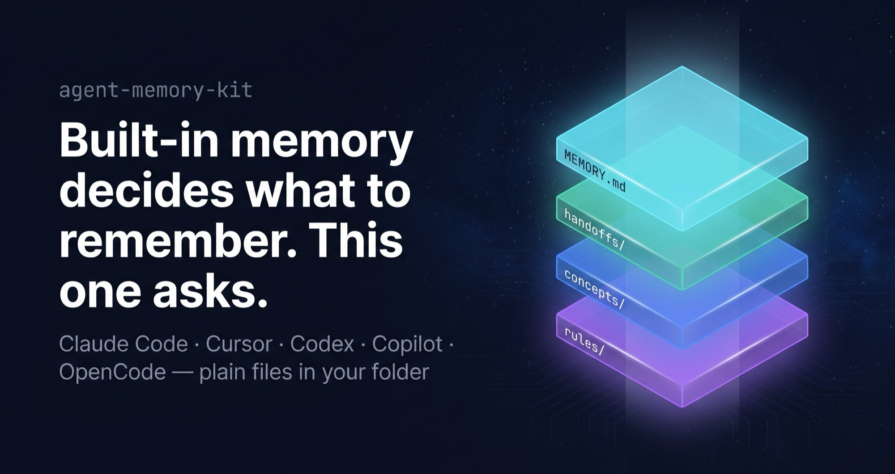
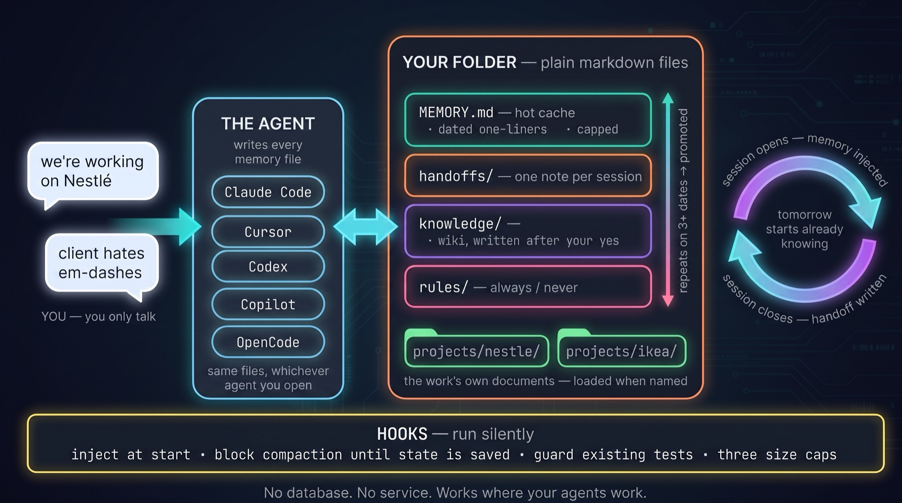
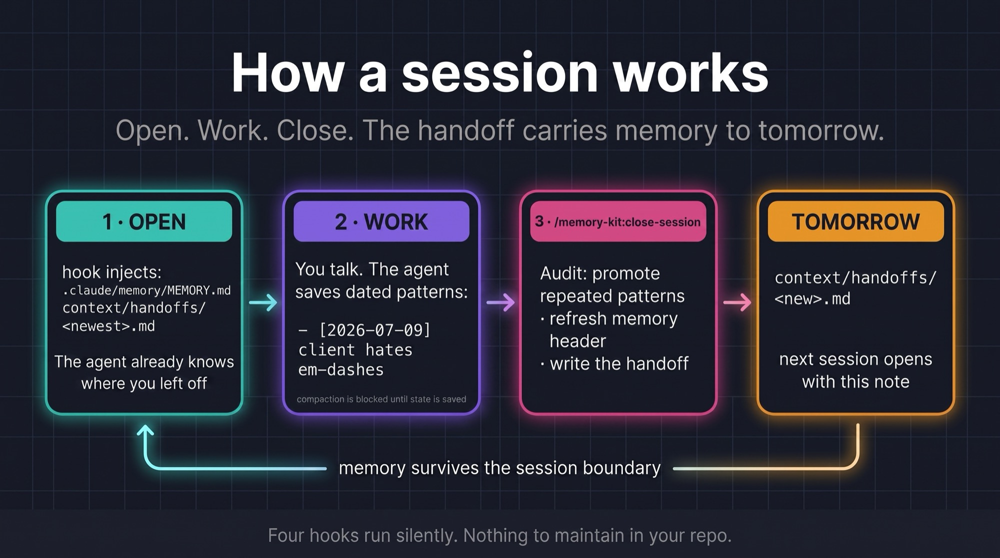
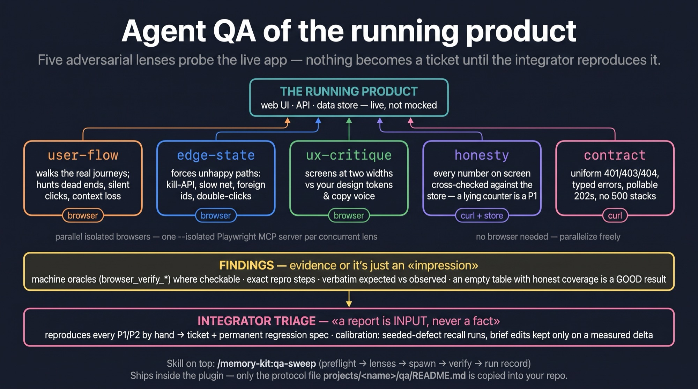

# Memory Kit

**Built-in memory decides what to remember. This one asks.**

Your agent proposes, you say yes, it writes a dated line into plain files in your own folder.
One memory per client, readable by every agent you run, nothing remembered without your yes.

[](https://github.com/awrshift/agent-memory-kit/releases)
[](LICENSE)
[](docs/specs/README.md)

> *"I wake up already knowing where we left off."* — the agent this kit builds.

## Install

Three commands in Claude Code, inside the folder where you work. Any folder will do; git is
optional, and only needed if you want the wiki and rules to carry their history.

```shell
/plugin marketplace add awrshift/agent-memory-kit
/plugin install memory-kit@memory-kit
/memory-kit:setup
```

That is the technical part, and it happens once. From then on you only talk: work as usual, and
say `/memory-kit:close-session` when you are done for the day. No database, no service, no
extra cost. Setup reads what your folder already has and **proposes before writing anything**;
your `CLAUDE.md` stays yours. Other agents install from the same repository, see
[Works with your agents](#works-with-your-agents).

<details>
<summary>Upgrading later, two commands, and the second needs the full id</summary>

```shell
claude plugin marketplace update memory-kit     # refresh the catalog
claude plugin update memory-kit@memory-kit      # the bare name resolves to nothing
```

Restart the session to apply. Upgrades never touch your files. Memory, handoffs and knowledge
live in your folder, not in the plugin.
</details>

## The problem

Every session starts from zero: yesterday you locked the brand voice for a client, today you
explain it again. Your tools do remember things now, but each one keeps its own notes, outside
your folder, and decides by itself what goes in. And memory nobody audits **rots**: a status
note that froze three weeks ago still reads like today's truth, and the agent confidently acts
on it.

Memory Kit's answer: **one set of plain text files in your folder**, written by the agent only
after you agree, with a date on every line so a stale fact looks stale.



## A day with it



1. **Open.** The agent wakes up already knowing: your hot cache, the note the last session
   left, and whether memory is healthy. You just continue.
2. **Work.** When something worth keeping comes up, the agent saves it as a dated one-liner and
   says "saved". Before the context is compressed, it has to save state. Editing an existing
   test needs your yes.
3. **Close.** `/memory-kit:close-session` audits instead of dumping logs: "you rejected
   em-dashes on three different dates, make it a rule?" You say yes, it writes, and leaves the
   note tomorrow's session opens with.

## Why not the built-in memory?

Claude Code, Cursor and Copilot all ship memory now, on by default. It is effortless, and it
is the vendor's silo. The kit is the opposite trade.

| | Built-in auto memory | Memory Kit | Database memory tools |
|---|---|---|---|
| Who decides what is remembered | the agent, silently | the agent proposes, **you approve** | the agent, silently |
| Where it lives | the vendor's directory, outside your folder | **plain files in your folder** | a database or a service |
| Can you read it, diff it, delete a wrong belief | partly | **yes, it is text in git** | through the tool's UI |
| One memory per client | no | **yes**, `projects/<client>/` | usually no |
| Read by other agents | no | **yes**, Claude Code, Cursor, Codex, Copilot, OpenCode | via that tool's integrations |
| How staleness shows | it doesn't | **every line carries its date**; caps force a prune | it doesn't |
| Cost at session start | its index, up to 200 lines / 25 KB (Claude Code's docs) | 2–4k tokens on a working cache, ~12k hard ceiling at the caps, plus ~2k of skill descriptions (measured 2026-09-02) | tool-specific |
| Infrastructure | none | **none** | a database, often a daemon or API key |

Running both means two writers and two truths, so `/memory-kit:setup` asks you to pick.
Either answer is legitimate.

## Many clients, one agent

The line is **memory vs paperwork**. What the agent *learned* is shared across everything you
do: patterns, knowledge, rules. What the work *produced* belongs to one client:
`projects/<client>/` holds that client's backlog, specs, research, decisions and QA records.
Say "we're working on Nestlé" and the agent loads that scope only. One folder per client, or
one repository per client, both work.

A pattern's journey: noticed, saved as a dated line, repeats on 3+ dates, the agent proposes
promotion, your "yes" makes it a knowledge article or a rule, and the raw lines are pruned.
Observation, candidate, law. You approve every step.

## Works with your agents

| Agent | What you get |
|---|---|
| **Claude Code** | full enforcement: memory injected every session, compaction blocked until state is saved, test edits guarded |
| **Cursor** | memory injected at session start, all 8 skills ([verified](docs/specs/cursor.md)) |
| **OpenCode** | memory injected into EVERY model call via the shipped plugin ([verified](docs/specs/opencode.md)) |
| **Codex** | all 8 skills, the memory discipline via an `AGENTS.md` protocol block ([verified](docs/specs/codex.md)) |
| **GitHub Copilot CLI** | all 8 skills, the `AGENTS.md` protocol block ([verified](docs/specs/copilot.md)) |
| **Claude Cowork** (desktop) | skills only: Cowork does not run plugin hooks yet, so memory is not injected there ([documented](docs/specs/cowork.md)) |
| **Anything else, incl. CI** | the memory is plain text in your folder: readable, greppable, git-versioned |

<details>
<summary>Install commands for the other agents</summary>

```shell
codex plugin marketplace add awrshift/agent-memory-kit && codex plugin add memory-kit@memory-kit
cursor-agent plugin marketplace add https://github.com/awrshift/agent-memory-kit
copilot plugin marketplace add awrshift/agent-memory-kit && copilot plugin install memory-kit@memory-kit
```

OpenCode takes one line in `opencode.json`:
`"plugin": ["memory-kit@git+https://github.com/awrshift/agent-memory-kit.git"]`

Hosts that cannot run hooks get the same discipline as an always-loaded instruction:
`/memory-kit:setup` offers a small protocol block for your `AGENTS.md`. Every claim is probed,
dated and labeled in [docs/specs/](docs/specs/README.md), degradation stated, never hidden.
</details>

## Private by default

Everything is plain text on your machine; nothing leaves. The hot cache and the session notes
are gitignored by default, so they stay private even if you push. `knowledge/` and rules are
tracked: they are your curated wiki, keep the repository private or prune before publishing.
Working from two machines, or sharing memory with a teammate? Say so at `/memory-kit:setup`
and the hot cache gets committed instead.

<details>
<summary><b>What if I forget to run /close-session?</b></summary>

Nothing breaks. Compaction still refuses to run over unsaved state, and the next session still
opens with your hot cache. You lose that session's handoff note and the pattern audit, the
deliberate part. Run it next time.
</details>

<details>
<summary><b>For builders: the orchestration and QA layers (opt-in)</b></summary>

The same plugin carries the orchestration discipline distilled from hundreds of multi-agent
sessions: specs as files with pre-registered acceptance, `executor` / `recon` /
`idea-validator` agents, adversarial `/session-review` and `/second-opinion`, and a multi-lens
`/qa-sweep` for running products. All lazy-loaded skills, they cost nothing until invoked.




Depth: [docs/ARCHITECTURE.md](docs/ARCHITECTURE.md) and the plugin's
[reference/](plugins/memory-kit/reference/).
</details>

<details>
<summary><b>How it is built: where memory lives, what is in the repo</b></summary>


Four files, each answering a different question. The agent writes all of them, you only talk.
Three size caps on the hot cache (180 lines / 32 KB / 3000 chars per line), checked every
session, because line count alone lies while content densifies. A stale-reference detector
checks that paths mentioned in memory still exist on disk.

```
.claude-plugin/marketplace.json   ← THE catalog: Claude Code, Codex and Copilot install from it
.cursor-plugin/                   ← metadata for Cursor's central-marketplace listing only
plugins/memory-kit/               ← the plugin: hooks · skills · agents · templates
docs/specs/                       ← what each host actually honours, probe by probe
docs/ARCHITECTURE.md              ← the full design, with rationale
```

In **your** folder the kit owns only state: `.claude/memory/MEMORY.md`, `context/handoffs/`,
`knowledge/`, `.claude/rules/`, plus one `projects/<name>/` per client.
</details>

## Origin

Built and used daily by one operator since March 2026, across marketing, research and product
work, in Claude Code first and the other agents as they arrived. The scars are in the changelog:
a daily journal, a rolling status file, a staging layer and several more were retired because
they quietly rotted, and for a year the kit claimed its hot cache was "always loaded" while the
hook only measured it. v6 found that, fixed it, and CI now
checks the injection on every push. What remains is what kept earning its place.

**Tell me how your first week went:** [open a note](https://github.com/awrshift/agent-memory-kit/issues/new?template=first-week.md).
It is the only feedback channel, and it decides what gets built next.

**Architecture:** [docs/ARCHITECTURE.md](docs/ARCHITECTURE.md) ·
**Per-host specs:** [docs/specs/](docs/specs/README.md) ·
**Changelog:** [docs/CHANGELOG.md](docs/CHANGELOG.md) ·
**Contributing:** [docs/CONTRIBUTING.md](docs/CONTRIBUTING.md) ·
**Open decisions:** [docs/DECISIONS.md](docs/DECISIONS.md)

MIT, see [LICENSE](LICENSE).
