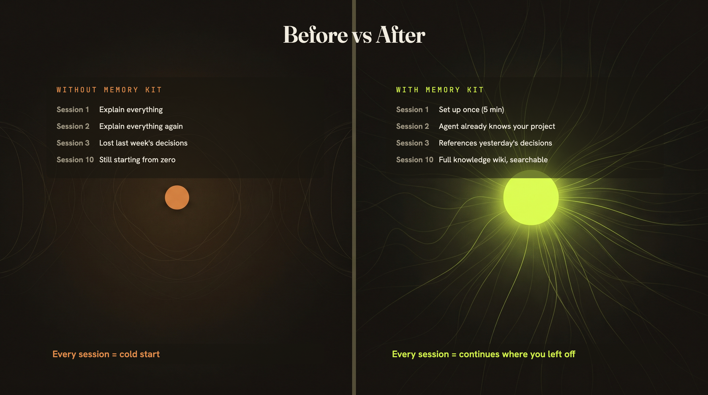
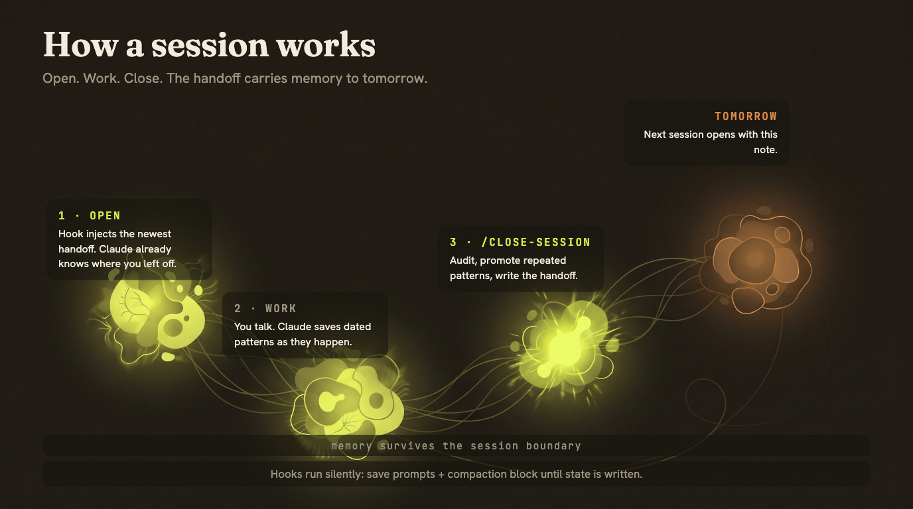
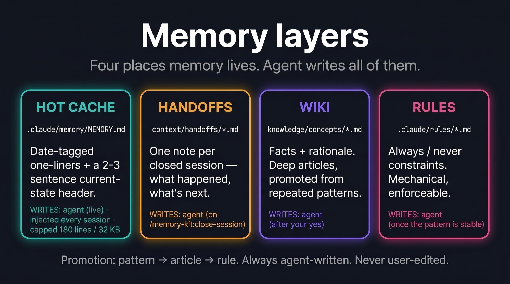
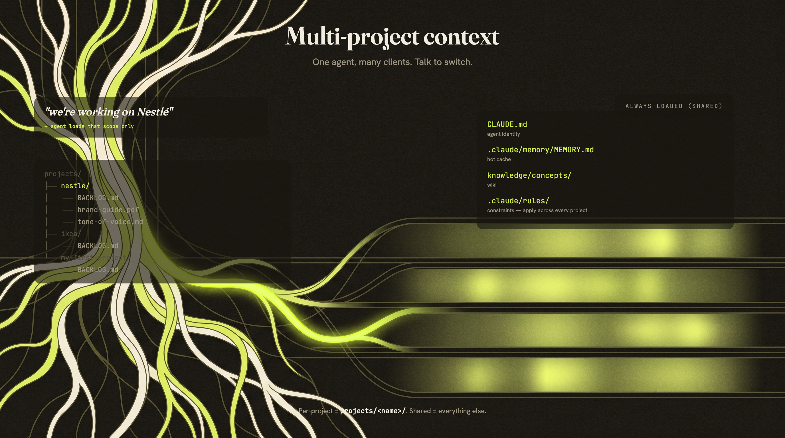
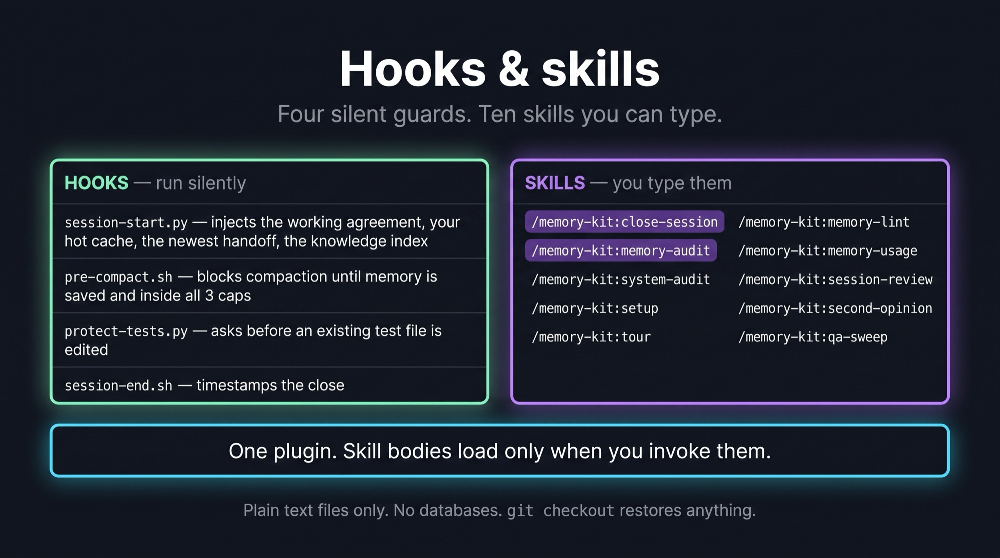
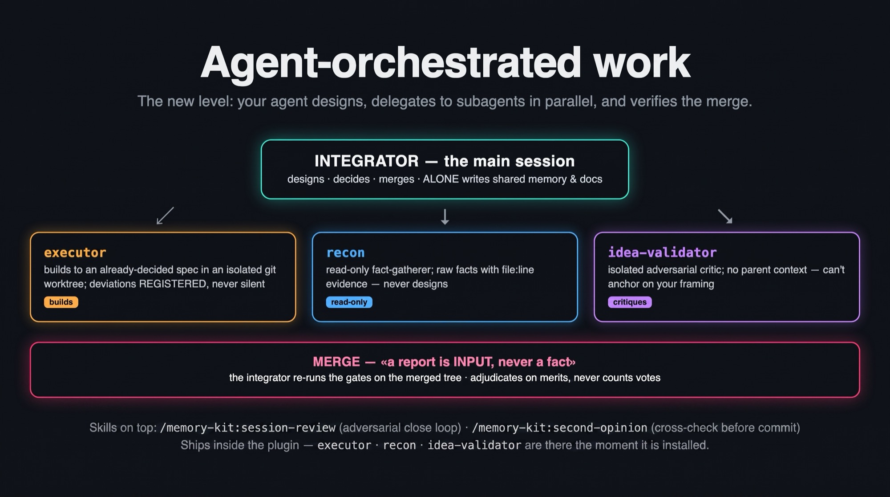

# Claude Memory Kit

**The starter kit for Claude Code — persistent memory edition.**
**Your Claude remembers everything. Every client, every brief, every decision. Across sessions. Zero setup.**

[](https://github.com/awrshift/claude-memory-kit/releases)
[](LICENSE)
[](https://docs.anthropic.com/en/docs/claude-code/overview)

> *"I wake up already knowing where we left off."* — the agent this kit builds.
> Read [its day](https://awrshift.com).

## The problem

Every time you open Claude, it forgets everything. Yesterday you locked the brand voice. Today
you have to explain it again. Last week it helped you find the right campaign angle — this week
you can't remember exactly how.

The first 10 minutes of every session go to re-explaining what Claude **already knew**.

**Memory Kit fixes this. Free. Runs on top of your Claude Pro or Max subscription.**

Built for **automators and consultants running many clients**: one clone of the kit per client
or vertical — each with its own accumulated memory, all with the same working discipline.
([The story](#origin): 1000+ sessions, 12 months in production, one operator.)

## Quick start

The kit is a **Claude Code plugin** — it installs into a repository you already have. Nothing to
clone, nothing to paste into `CLAUDE.md`.

```shell
/plugin marketplace add awrshift/claude-memory-kit
/plugin install memory-kit@memory-kit
/memory-kit:setup
```

`setup` looks at what your repo already has, proposes the memory layers, asks who owns memory
(the kit or Claude Code's built-in auto memory — running both means two writers and two truths),
and installs permission rails. It writes nothing before you say yes.

Starting from zero rather than an existing project? Make an empty folder, run `claude` in it and
do the same three lines.

> [!TIP]
> Say `/memory-kit:tour` after setup — Claude walks you through the system using your own files.
>
> Upgrading from v5 (the clone-the-repo layout)? See [docs/CHANGELOG.md](docs/CHANGELOG.md#600).

---

## Before / after



| | Without Memory Kit | With Memory Kit |
|---|---|---|
| **New session** | "What were we working on?" | Opens with last session's handoff already loaded |
| **After 10 sessions** | Nothing accumulates | Searchable base of decisions, tones, patterns |
| **Multiple clients** | Chaos | Each client has its own folder, everything in place |
| **Context compaction** | Silently loses data | Hook blocks compaction until state is saved |
| **Memory bloat** | Grows until useless | Three size caps, watched automatically every session |

---

## How a session works



Three steps. That's the entire workflow:

### 1. Open a session — Claude wakes up already knowing where you left off
Claude auto-loads context: the **handoff** (the note the previous session left), memory health
stats, your projects, the knowledge index. You do nothing — you just see "here's where we left
off" and continue.

### 2. Work as usual — the habits run without you asking
Talk to Claude. Write copy. Do research. Lock the tone. When something worth keeping comes up,
Claude saves it as a dated one-liner and tells you "saved". Safety hooks run silently — they
prompt a save every ~50 messages and physically block context compaction until state is written.

### 3. Close the session — the note to tomorrow's you
Say `/close-session`. Claude **doesn't just** dump logs — it audits: "noticed you rejected
em-dashes on three different dates — make it a tone-of-voice rule?" You say "yes", it writes.
Then it leaves a note for tomorrow-you. **Tomorrow's session opens with that note
already loaded.**

---

## Where memory lives



Four places, each answering a different question. Claude writes all of them — you only talk.

| Layer | Site calls it | Answers | Written |
|---|---|---|---|
| `.claude/memory/MEMORY.md` | hot memory | "what patterns repeat" + "where things stand" | while you talk |
| `context/handoffs/*.md` | the note to tomorrow's me | "what happened, session by session" | at `/close-session` |
| `knowledge/concepts/*.md` | cold memory | "facts and rationale by topic" | after your "yes" |
| `.claude/rules/*.md` | habits | "what must always / never happen" | after months of stable pattern |

**A pattern's journey:** noticed in conversation → saved as a dated line in MEMORY →
repeats on 3+ dates → Claude proposes promotion → your "yes" → becomes a knowledge article or
a rule, and the raw lines are pruned. Observation → candidate → law. You approve every step.


---

## Why it doesn't rot

Memory systems don't usually die loudly — they rot quietly: a "current state" file that froze
three weeks ago but still looks authoritative; a memory file that grew so dense it's unreadable.
It is built around the failure modes we hit in real long-running use:

- **Three size caps on MEMORY.md** (180 lines / 32 KB / 3000 chars per line), checked by a hook
  at every session start. Three, because line count alone lies — content can densify into
  ever-longer lines while the line count stays flat. When a cap trips, the session opens with
  an audit prompt instead of silently growing.
- **Handoffs instead of a rolling status file.** One immutable note per closed session; the
  newest one is injected automatically. A note that says its date can't pretend to be current.
- **Stale-reference detector.** Every session start, file paths mentioned in memory are checked
  against disk; anything that moved or vanished is flagged. A memory that references dead files
  is the #1 way agents confidently act on outdated beliefs.
- **The header rule.** The top of MEMORY.md is "current state in 2-3 sentences", *replaced* at
  every close — never a stack of "previous session" paragraphs.
- **The memory is actually in context.** v6 injects the hot cache itself at session start, and
  re-injects it after compaction. (v5 only *measured* it while claiming it was always loaded —
  a year-long silent failure, found by asking "prove it's in context", not by reading the code.)

---

## Multiple clients



Each client = their own folder. Shared layers (rules, memory, wiki) load for every project.
Per-project materials load when you name the project.

Say "we're working on Nestlé" — Claude unloads other clients and loads that scope only.

---

## Hooks and operators



Four hooks run silently, all inside the plugin — nothing to maintain in your repo. One injects
your memory and the working agreement at every session start (and after each compaction), one
blocks compaction until state is saved, one asks before an existing test gets edited, one logs
the close.

Everything else is a skill, and skills cost nothing until you invoke them:

| Skill | For |
|---|---|
| `/memory-kit:close-session` | the end-of-session ritual — capture, promote, hand off |
| `/memory-kit:memory-audit` | the cap-trip surgery: what leaves the hot cache, by approved plan |
| `/memory-kit:system-audit` | the periodic seven-lens sweep of the whole system, evidence-backed |
| `/memory-kit:setup` · `:tour` | adopt the kit here · walk through it on your own files |
| `/memory-kit:memory-lint` · `:memory-usage` | knowledge-base hygiene · hot-vs-cold telemetry |
| `/memory-kit:session-review` · `:second-opinion` | adversarial review of a session · of one decision |
| `/memory-kit:qa-sweep` | multi-lens agent QA of a running product |

Everything in plain text files. No databases. No external services. `git checkout` restores anything.

---

## Agent-orchestrated work (opt-in)



When you use the kit to BUILD things — software, agent systems, research pipelines — there's a
next level: your agent stops doing everything in one thread and starts **orchestrating agents**.
The main session designs and decides; `executor` subagents build to a decided spec in isolated
git worktrees; `recon` gathers facts read-only; `idea-validator` attacks the design from a fresh
context. The integrator merges, re-runs the gates on the merged tree, and treats every subagent
report as INPUT — never as a fact.

Two skills close the loop: `/session-review` (an adversarial review of the session's work by
independent reviewers before it sets) and `/second-opinion` (cross-check a high-stakes answer
before committing to it).

**v5.2 makes the loop self-improving.** Every nontrivial diff passes an automated code review
before merge; every *confirmed* finding is logged by class, and a class that recurs three times
is promoted into the cheapest layer that prevents it forever — a lint rule, a line in an agent
definition, a review-brief line. Rules that stop firing get dropped. Your review process
compounds instead of repeating itself.


And when what you're building is a user-facing product, the **QA layer** puts agents on the
other side of the screen: `/qa-sweep` fans out `qa` subagents over the *running* app — five
adversarial lenses (user-flow · edge-state · honesty · contract · ux-critique), parallel
isolated browsers, findings that must carry machine-checkable evidence — and nothing becomes a
ticket until the integrator reproduces it. A calibration ladder (seeded-defect recall runs,
brief edits kept only on a measured delta) keeps the lenses sharp.

All of it ships in the same plugin — the agents and skills are simply there when you invoke
them. The one always-on piece is optional and deliberately tiny: `/memory-kit:setup` offers to
drop a ~20-line `orchestration.md` into `.claude/rules/`, which is what makes the invariants
binding rather than advisory. Depth stays in the plugin's `reference/`, read on demand.
Distilled from hundreds of real multi-agent sessions in the maintainers' production repos.

---

## FAQ

<details>
<summary><b>I'm not a programmer. Will this work?</b></summary>

Yes. You talk to Claude in plain language. "Read the client brief and propose three newsletter
topics" — works. Install is one command. You never edit the memory files yourself — that's the
kit's first rule: *you only talk, Claude writes*.

</details>

<details>
<summary><b>How much does it cost?</b></summary>

The kit itself is free, open source. You need a Claude Pro or Max subscription (which you
probably already have). No additional cost.

</details>

<details>
<summary><b>Is my data private?</b></summary>

Yes. Everything is stored on your computer in plain text files. Nothing leaves. Your personal
layers — `MEMORY.md` and the session handoffs — are gitignored by default, so they stay private
even if you push the repo (the kit creates your `MEMORY.md` from a template on first run).
`knowledge/` articles and `.claude/rules/` ARE tracked — they're your curated wiki, meant to
live in the repo; keep the repo private (or prune them) before publishing it anywhere.

</details>

<details>
<summary><b>Can I use it with an in-progress project?</b></summary>

Yes. On install, tell Claude you already have a project — it analyses it and integrates.

</details>

<details>
<summary><b>What if I forget to run /close-session?</b></summary>

Nothing breaks. Safety hooks save progress automatically every ~50 messages and before any
context compaction. `/close-session` is the cherry on top — the deliberate audit where patterns
get promoted to permanent knowledge and the handoff note gets written.

</details>

<details>
<summary><b>What if I accidentally break a memory file?</b></summary>

The kit's tracked files revert with one `git checkout`. Your private layers (`MEMORY.md`,
handoffs) are gitignored, so git can't restore those — but the hooks checkpoint them
continuously, and if `MEMORY.md` ever disappears the session-start hook recreates it from the
template. If you want your private memory versioned too, remove those two lines from
`.gitignore` in your own (private) clone.

</details>

<details>
<summary><b>I liked the daily journal (/close-day). Where did it go?</b></summary>

Retired in v6. It was demoted to opt-in in v5 for a reason — in long-running use the chronicle
was the layer that silently rotted whenever a day got skipped — and in practice nobody enabled
it: `/close-session` covers the same ground per session and cannot go stale unnoticed. The code
is still in git history if you want it back.

</details>

<details>
<summary><b>What if I'm on v5 (the cloned-repo layout)?</b></summary>

Keep your repo, install the plugin into it, and delete the copies it replaces. Your memory
entries, handoffs, knowledge articles and rules stay exactly where they are — v6 reads the same
paths. Mechanical steps: [docs/CHANGELOG.md](docs/CHANGELOG.md#600).

</details>

---

## What's inside

This repository is the **marketplace**; the plugin is what you install.

```
.claude-plugin/marketplace.json   ← the catalog (one plugin)
plugins/memory-kit/
  .claude-plugin/plugin.json      ← the manifest
  context/identity.md             ← the working agreement, injected every session
  hooks/                          ← session-start · pre-compact · protect-tests · session-end
  skills/                         ← close-session, memory-audit, system-audit, setup, tour,
                                    memory-lint, memory-usage, session-review, second-opinion,
                                    qa-sweep
  agents/                         ← executor · recon · idea-validator · qa
  templates/                      ← what /memory-kit:setup scaffolds into YOUR repo
  reference/                      ← depth, read on demand (fact-check, parallel dev,
                                    doc governance, decisions log, review loop, QA protocol)
  scripts/                        ← the lint / usage collectors
docs/                             ← architecture · changelog · contributing
```

In **your** repository the kit owns only state: `.claude/memory/MEMORY.md`,
`context/handoffs/`, `knowledge/`, and — if you want them — `projects/<name>/` for real client
work and `experiments/<name>-YYYYMMDD/` for hypotheses (rough OK, distil on close, then delete).

**Full architecture:** [docs/ARCHITECTURE.md](docs/ARCHITECTURE.md)
**Version history:** [docs/CHANGELOG.md](docs/CHANGELOG.md)
**Contributing:** [docs/CONTRIBUTING.md](docs/CONTRIBUTING.md)

---

## Origin


This is not a template written in an afternoon — it's an architecture distilled from
**1000+ real sessions over 12 months of continuous daily Claude Code work**, by one operator,
across very different verticals: marketing, sales, lead generation, business analysis,
research & development, and shipping production code side-by-side with backend and frontend
engineers.

One person. One agent architecture. Cloned per vertical — each clone accumulating its own
memory, rules, and knowledge base while the working discipline stays the same. That's exactly
who it fits best: **automators and consultants running many clients** — spin up a clone per
client, and memory keeps every engagement scoped, accumulated, and instantly resumable.

Everything here survived that year of production use — including the scars: the parts that
quietly rotted (the daily chronicle, the rolling status file) were retired, and what remains
is what kept earning its place.

## Help

Issues and PRs welcome. See [docs/CONTRIBUTING.md](docs/CONTRIBUTING.md).

## License

MIT — see [LICENSE](LICENSE).
