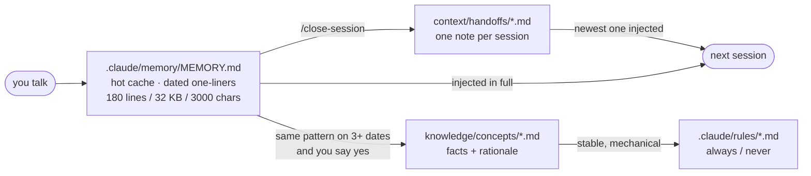
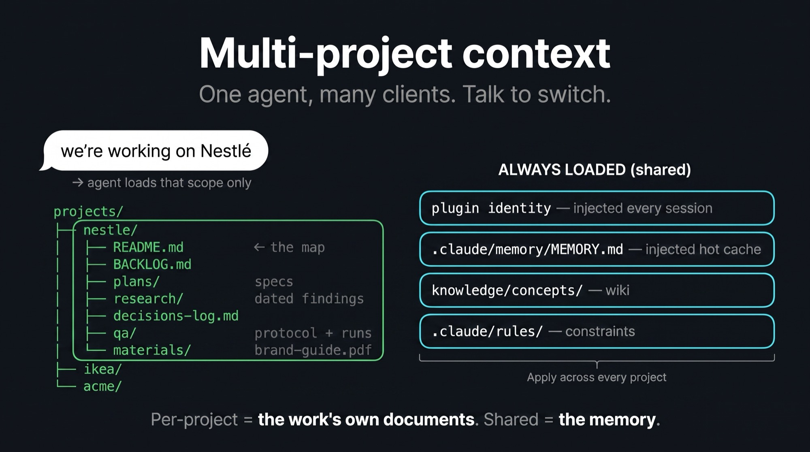

# Memory Kit

**One memory for every coding agent.**
**Plain markdown in your repository — injected on Claude Code and Cursor, followed by Codex,
readable by anything. Dated, capped, audited: it doesn't rot.**

[](https://github.com/awrshift/agent-memory-kit/releases)
[](LICENSE)
[](docs/specs/README.md)

> *"I wake up already knowing where we left off."* — the agent this kit builds.

## Install

In Claude Code, into a repository you already have:

```shell
/plugin marketplace add awrshift/agent-memory-kit
/plugin install memory-kit@memory-kit
/memory-kit:setup
```

Work as usual; say `/memory-kit:close-session` when you're done. That's the whole loop — no
database, no service, no extra cost. Setup reads what your repo already has and **proposes
before writing anything**; your `CLAUDE.md` stays yours. Codex and Cursor install from the
same repository — see [Works with your agents](#works-with-your-agents).

<details>
<summary>Upgrading later — two commands, and the second needs the full id</summary>

```shell
claude plugin marketplace update memory-kit     # refresh the catalog
claude plugin update memory-kit@memory-kit      # the bare name resolves to nothing
```

Restart the session to apply. Upgrades never touch your repo — memory, handoffs and knowledge
live in your files, not in the plugin.
</details>

## The problem

Every session starts from zero: yesterday you locked the brand voice, today you explain it
again. What your tools do remember is scattered — Claude Code's notes in one silo, Cursor's in
another, none of it in your repo, none of it yours. And memory nobody audits **rots**: a
status file that froze three weeks ago still reads like today's truth, and the agent
confidently acts on it.

Memory Kit's answer: **one set of plain markdown files in your repository.** Every agent reads
the same memory, one discipline keeps it honest, git owns the history.

## How a session works


1. **Open** — the agent wakes up already knowing: your hot cache, the note the last session
   left, memory-health stats. You just continue.
2. **Work** — when something worth keeping comes up, the agent saves it as a dated one-liner
   and says "saved". Compaction is blocked until state is written; editing an existing test
   needs your yes.
3. **Close** — `/memory-kit:close-session` audits instead of dumping logs: "you rejected
   em-dashes on three different dates — make it a rule?" You say yes, it writes, and leaves
   the note tomorrow's session opens with.

## Works with your agents

| Agent | What you get |
|---|---|
| **Claude Code** | full enforcement: memory injected every session, compaction blocked until state is saved, test edits guarded |
| **Cursor** | memory injected at session start + all 8 skills ([verified](docs/specs/cursor.md)) |
| **Codex** | all 8 skills + the memory discipline via an `AGENTS.md` protocol block ([verified](docs/specs/codex.md)) |
| **Anything else, incl. CI** | the memory is plain markdown in your repo — readable, greppable, git-versioned |

```shell
codex plugin marketplace add awrshift/agent-memory-kit && codex plugin add memory-kit@memory-kit
cursor-agent plugin marketplace add https://github.com/awrshift/agent-memory-kit
```

Hosts that can't run hooks get the same discipline as an always-loaded instruction:
`/memory-kit:setup` offers a small protocol block for your `AGENTS.md`. Every claim above is
probed, dated and labeled in [docs/specs/](docs/specs/README.md) — degradation stated, never
hidden.

## Where memory lives



Four files, each answering a different question — the agent writes all of them, you only talk.
A pattern's journey: noticed → saved as a dated line → repeats on 3+ dates → the agent
proposes promotion → your "yes" makes it a knowledge article or a rule, and the raw lines are
pruned. Observation → candidate → law. You approve every step.

## Why it doesn't rot

Memory systems don't die loudly — they rot quietly. The kit is built around the failure modes
a year of production actually produced:

- **Three size caps** on the hot cache (180 lines / 32 KB / 3000 chars per line), checked
  every session — because line count alone lies while content densifies.
- **Every entry carries a date.** Undated memory is noise; dated memory makes repetition —
  and staleness — visible.
- **Handoffs instead of a rolling status file.** One immutable note per session; a note that
  states its date can't pretend to be today's.
- **A stale-reference detector**: paths mentioned in memory are checked against disk every
  session start.
- **Nothing is remembered without a decision** — unlike auto-memory, every promotion needs
  your yes, and `git log` shows how the project's memory evolved.

## Many clients, one discipline



One repo per client, or one workspace with `projects/<name>/` per client — both supported. The
line is **memory vs paperwork**: what the agent *learned* is shared (patterns, knowledge,
rules); what the work *produced* belongs to one project (backlog, specs, research, decisions,
QA). Say "we're working on Nestlé" and the agent loads that scope only.

## For builders (opt-in)

The same plugin carries the orchestration discipline distilled from hundreds of multi-agent
sessions: specs as files with pre-registered acceptance, `executor`/`recon`/`idea-validator`
agents, adversarial `/session-review` and `/second-opinion`, and a multi-lens `/qa-sweep` for
running products. All lazy-loaded skills — they cost nothing until invoked. Depth:
[docs/ARCHITECTURE.md](docs/ARCHITECTURE.md) and the plugin's
[reference/](plugins/memory-kit/reference/).

## FAQ

<details open>
<summary><b>How is this different from my agent's built-in memory?</b></summary>

Built-in auto-memory is effortless — and it is the vendor's silo: the agent decides what
enters it, the record lives outside your repo, and no other tool can read it. The kit is the
opposite trade: nothing remembered without a decision, everything a plain file in git that any
agent reads. Running both means two writers and two truths, so `/memory-kit:setup` asks you to
pick — either answer is legitimate.
</details>

<details>
<summary><b>I'm not a programmer. Will this work?</b></summary>

Yes. You talk in plain language; you never edit memory files yourself — that's the kit's first
rule: *you only talk, the agent writes.*
</details>

<details>
<summary><b>Is my data private?</b></summary>

Everything is plain text on your machine; nothing leaves. `MEMORY.md` and handoffs are
gitignored by default (created at setup), so they stay private even if you push. `knowledge/`
and rules ARE tracked — they're your curated wiki; keep the repo private or prune before
publishing.
</details>

<details>
<summary><b>What if I forget to run /close-session?</b></summary>

Nothing breaks. The PreCompact hook still refuses to compact over unsaved state, and the next
session still opens with your hot cache. You lose that session's handoff note and pattern
audit — the deliberate part. Run it next time.
</details>

## Origin

Distilled from **1000+ real sessions over 12 months** of daily agent work by one operator
across marketing, R&D and production code — including the scars: the layers that quietly
rotted were retired, and what remains is what kept earning its place. Write-up:
[awrshift.com](https://awrshift.com).

**Architecture:** [docs/ARCHITECTURE.md](docs/ARCHITECTURE.md) ·
**Per-host specs:** [docs/specs/](docs/specs/README.md) ·
**Changelog:** [docs/CHANGELOG.md](docs/CHANGELOG.md) ·
**Contributing:** [docs/CONTRIBUTING.md](docs/CONTRIBUTING.md) ·
**Open decisions:** [docs/DECISIONS.md](docs/DECISIONS.md)

MIT — see [LICENSE](LICENSE).
