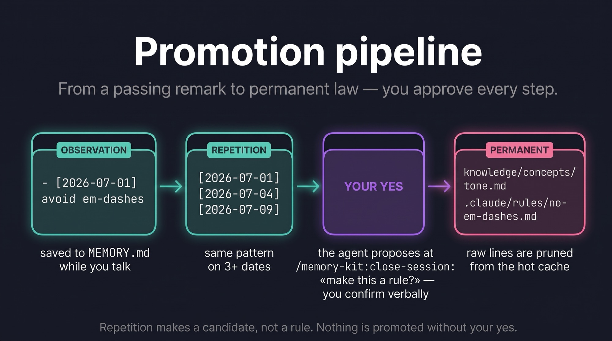
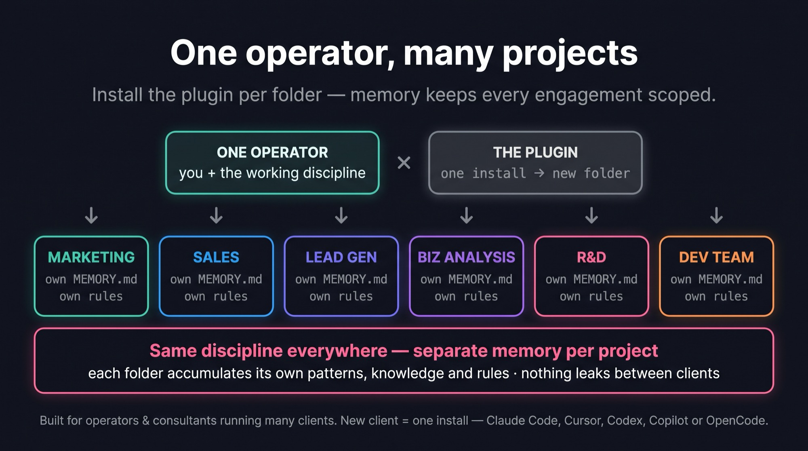
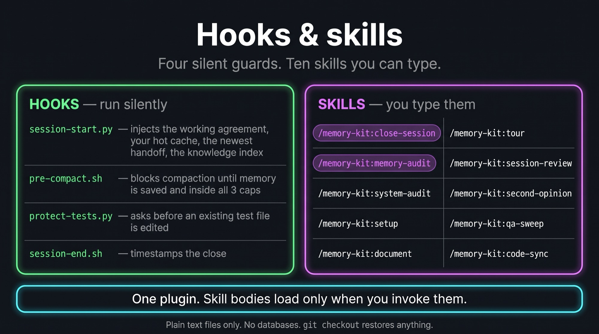

# Memory Kit v7 — Architecture

> Full architecture with rationale. Read after the plugin's `context/identity.md` for depth.

## The core invariant

**User only talks. Agent captures, proposes, writes.** This is the one rule that makes everything else consistent.

If an architectural decision violates this invariant (e.g., «user should periodically review memory files and edit them»), it's wrong by definition.

## Layer map (what lives where)

v6 ships as ONE Claude Code plugin. The plugin owns behaviour (hooks, skills, agents, templates);
your repository owns state (memory, handoffs, knowledge). Nothing is copied into `.claude/` except
the state you agreed to in `/memory-kit:setup`, and there is no `CLAUDE.md` block to paste — a
plugin cannot ship `CLAUDE.md` or `.claude/rules/`, so the working agreement is injected by the
SessionStart hook and versioned with the plugin. Every layer maps to a native Claude Code concept
documented at `code.claude.com/docs`.

```
╔══════════════════════════════════════════════════════════════╗
║  SESSION ENTRY (injected by the plugin's session-start.py)   ║
║  ──────────────────────────────────────────────────────────  ║
║  1. context/identity.md — the working agreement (plugin)     ║
║  2. Memory-discipline nudges — ONLY when they fire           ║
║       (the three MEMORY.md caps, session-headed blocks,      ║
║        stale file references)                                ║
║  3. Session stats — MEMORY.md size vs caps,                  ║
║       projects/experiments overview, git state               ║
║  4. .claude/memory/MEMORY.md — THE HOT CACHE ITSELF          ║
║  5. context/handoffs/<newest>.md — "where we left off"       ║
║  6. knowledge/index.md — the catalog of deep memory          ║
║                                                              ║
║  Profiles: startup/clear/fork → all six · compact → 1 + 4    ║
║  plus a one-line pointer to the newest handoff               ║
║  (what compaction drops) · resume → 2 + 3 only               ║
╠══════════════════════════════════════════════════════════════╣
║  ALSO IN CONTEXT (loaded by Claude Code itself)              ║
║  ──────────────────────────────────────────────────────────  ║
║  CLAUDE.md                  — YOUR project's own, if any     ║
║  .claude/rules/*.md         — unconditional or `paths:`-     ║
║                               scoped project rules           ║
║  (+ every skill's `description` — body loads on invoke)      ║
╠══════════════════════════════════════════════════════════════╣
║  ON-TRIGGER (loaded when relevant)                           ║
║  ──────────────────────────────────────────────────────────  ║
║  skills/<task>/SKILL.md         — plugin skills, body loads  ║
║                                   only when invoked          ║
║  reference/*.md                 — depth, read on demand      ║
║  knowledge/concepts/*.md        — deep reference articles    ║
║  projects/<active>/              — that project's OWN docs:  ║
║      README.md (the map) · BACKLOG.md · plans/ (specs) ·     ║
║      research/ · decisions-log.md · review-findings.md ·     ║
║      qa/ · materials/ — loaded when the project is named     ║
╠══════════════════════════════════════════════════════════════╣
║  HANDOFF HISTORY (grep-on-demand, not auto-loaded wholesale) ║
║  ──────────────────────────────────────────────────────────  ║
║  context/handoffs/<topic>-YYYY-MM-DD.md                      ║
║      — one immutable note per closed session; only the       ║
║        NEWEST is injected at session entry                   ║
╠══════════════════════════════════════════════════════════════╣
║  OPERATORS (invoked by user speech)                          ║
║  ──────────────────────────────────────────────────────────  ║
║  all namespaced /memory-kit:<name>                           ║
║  close-session    end-of-session AUDIT ritual + handoff      ║
║  memory-audit     cap-trip surgery on the hot cache          ║
║  system-audit     periodic 7-lens sweep of the whole system  ║
║  setup · tour     adopt the kit here · walkthrough           ║
║  session-review   adversarial close loop                     ║
║  second-opinion   cross-check before commit                  ║
║  qa-sweep         multi-lens QA of the running app           ║
║  document         PR · changelog · release note · postmortem ║
║  code-sync        specs reconciled against the code          ║
╚══════════════════════════════════════════════════════════════╝
```


## v7 — the development lifecycle layer

v6 covers two layers: memory between sessions, and orchestration (the main session decides, an
`executor` builds to a spec file, a report is INPUT and never a fact). v7 adds the middle one —
the path from a task to a decided spec, to a build that refuses to invent decisions, to proof
against that spec, to a human-readable record, to documents reconciled with the code. **No fifth
memory layer**: everything new lives in `projects/<name>/`, or in an operator that walks it.
The design, with its rejected alternatives, is [V7-DESIGN.md](V7-DESIGN.md).

### The acceptance-criteria thread

One id runs through the whole lifecycle. A spec's Acceptance rows are numbered `AC-1…n`
(`templates/workspace/project/SPEC-TEMPLATE.md`), and every later artifact quotes those ids
instead of paraphrasing the requirement:

```
spec Acceptance AC-3 ──▶ slice S2 "Serves: AC-3" ──▶ the test that names AC-3
        │                                                    │
        ▼                                                    ▼
qa run record: per-AC table "AC-3 | pass | walked path X"   review-findings row · AC | AC-3
        │
        ▼
spec Acceptance table: Verified = 2026-09-20 · qa/qa-run-20260920.md
```

The `Verified` column is filled by the integrator only, and only from a check they ran
themselves — an agent's report never passes an AC. This is the old "a DONE nobody verified is
IN PROGRESS" rule with an address: a `done` that cannot be traced to a `Verified` cell is not
done. The findings registry (`reference/review-loop.md`) carries the same id in an `AC` column
(`—` when a finding ties to no criterion), so a defect class and the criterion it breaks are
countable together.

### The input-coverage gate, and the `assumed` status

The failure this closes is an executor that silently invents a value nobody decided — a
threshold, a fallback, a sort order — and buries it in a diff that looks finished.

Every spec carries a **`## Value sources`** table: each value the slice must produce, compute or
display, against its named source (an input, a store column, a derivation, or a prior decision).
`agents/executor.md` runs the gate **before the first file**: enumerate the values, check each
against that table, and any value with no source is an **OWED DECISION** — the build STOPS and
the executor reports in a fixed shape (`OWED DECISION · value: … · needed by: AC-n ·
candidates: …`). Feeling is not the test; the list is.

The integrator may answer "build anyway, assume X". Then, and only then, the executor writes
`plans/YYYY-MM-DD-<slug>-assumed.md` from `ASSUMED-SPEC-TEMPLATE.md` — status `assumed`, the
assumption, who authorised it, the code area it governs — and builds against that. It is the
single spec file an executor may create, and it never edits an existing one. An `assumed` spec
is a **debt**: it is owed ratification, `code-sync` lists it every run and the session-start
stats count it until the integrator either folds the decision into the real spec (and marks the
assumed one `superseded`) or changes the code.

### The workflow tier — one rigor dial per project

`projects/<name>/README.md` carries a `**Workflow tier:**` line, and a `BACKLOG.md` task may
override it with its own `**Tier:**`. It answers one question — how much proof a `done` owes:

| Tier | What `done` requires |
|---|---|
| `prototype` | build + the executor's own gate output |
| `alpha` | + the integrator's acceptance walk against the spec's `AC-n` |
| `beta` | + a `qa/qa-run-*.md` record and tests naming each `AC-n` |
| `ga` | + a review pass on the diff and a `document` entry for the change |

`executor`, `qa-sweep` and `code-sync` all read it, so rigor is decided once per project instead
of re-argued per task. At `prototype`, `qa-sweep` says so and stops rather than pretending.

### Two new operators

- **`document`** (`skills/document/SKILL.md`) owns the human record: a PR body, a `CHANGELOG.md`
  entry, `docs/releases/<version>.md`, `docs/postmortems/YYYY-MM-DD-<slug>.md`. Every sentence
  traces to a hunk or a commit it read via `git diff` / `git log` **in that invocation** — never
  to the session's memory of what it built. It never edits code, tests, configuration or a spec,
  never touches `MEMORY.md`, handoffs, a backlog or the findings registry, and does not run
  `git commit` or `gh pr create` unless asked. A postmortem *proposes* registry rows; it does
  not append them.
- **`code-sync`** (`skills/code-sync/SKILL.md`) owns the reconciliation: walk each project's
  `building` and `assumed` specs, check what they claim against the tree, flip `building → done`
  only from a gate it ran itself (at the tier's evidence bar), mark `stale` with a
  `**Stale since:**` line naming the reason and `file:line`, list `assumed` specs owed
  ratification, and refresh the README map plus `Last verified:`. **Surgical edits only** — a
  status value, a `Verified` cell, a stale line, a map row, a backlog Done line; it rewrites no
  prose, creates no file, deletes no document, never flips an `assumed` spec, and never touches
  memory, knowledge or rules. `--dry-run` prints the edit plan instead of applying it.

Both sit beside `close-session`, which is unchanged: `close-session` reconciles the SESSION with
memory, `code-sync` reconciles a PROJECT's documents with the CODE.

### Ownership — one writer per file

The v6 rule ("the main agent is the single integrator") holds; v7 states it per file, because
two of the writers are now skills:

| File | Created by | Changed by |
|---|---|---|
| `projects/<name>/README.md` (map, tier default) | setup / integrator | integrator; `code-sync` updates `Last verified` and map rows |
| `BACKLOG.md` | integrator | integrator; `code-sync` may flip a status line it can prove |
| `plans/*.md` (specs) | integrator, before any fan-out | integrator (content, status); `executor` only creates an `*-assumed.md`; `code-sync` flips `building → done/stale` status lines only |
| `qa/qa-run-*.md` | `qa-sweep` | nobody |
| `review-findings.md` | integrator | integrator |
| `CHANGELOG.md`, PR body, `docs/releases/`, `docs/postmortems/` | `document` | `document`, humans |
| `.claude/memory/MEMORY.md`, handoffs, knowledge, rules | unchanged (v6) | unchanged |

### Session entry: the spec flags

`hooks/session-start.py` adds, per project row in the stats block, `N specs assumed (owed
ratification) · M building > 14 d`. It reads only the header lines of `projects/*/plans/*.md`,
stdlib only, zero LLM; a count of zero prints nothing, an unparsable spec is skipped rather than
breaking the hook, and the threshold is `CMK_SPEC_STALE_DAYS` (default 14). A spec left
`building` for a fortnight is either done-but-unmarked or abandoned — both are a lie in the
project's own folder, and both are surfaced, never auto-corrected.

### The hot-path budget (the kit audits itself)

A skill body and an agent body load whole the moment they are invoked, so their size is a
context bill. `tools/check-repo.py` check 7 holds every `skills/*/SKILL.md` under **24 000
bytes** and every `agents/*.md` under **8 000 bytes**, prints a warning line at 90 % of the
ceiling and fails the run over 100 %. A kit that audits other repositories for bloat cannot
grow the same way unnoticed.

## What each layer is FOR (and is NOT)

### context/identity.md (in the plugin) — the working agreement
**Is:** how the agent works with memory here — the two invariants, the layer map, the caps, what
needs a "yes", and (since 6.1.1) the one place that names the operators and the `reference/`
directory, so depth that costs nothing until opened can actually be found. Injected at session
start and after compaction; versioned with the plugin.
**Is not:** your project's `CLAUDE.md`. That one is yours: stack, conventions, domain. The kit
never writes to it.

### .claude/memory/MEMORY.md — hot cache
**Is:** a current-state header (2-3 sentences, replaced every close) followed by date-tagged
one-liners captured during sessions — observations worth keeping, each with the date it was
seen, so that repetition on 3+ distinct dates becomes visible. Short strings. Cross-session
accumulator. Held under three caps (below).
**Is not:** full session logs (those live in the handoffs). Not detailed articles.

### context/handoffs/*.md — session handoffs
**Is:** one short note per closed session, `<topic>-YYYY-MM-DD.md`, written at `/close-session`
from `HANDOFF-TEMPLATE.md`. The SessionStart hook injects the NEWEST one, so tomorrow's session
opens already knowing where you left off. Older handoffs stay as searchable history.
**Is not:** a rolling file that gets overwritten (that was the v4 NSP — retired, see below). Not
a chronicle stacked into MEMORY.md's header.

### .claude/rules/*.md — rules
**Is:** mechanical constraints. "Don't use X", "Always check Y". Short. Enforceable by grep/linter in principle. Can be `paths:`-scoped to apply only when working with matching files.
**Is not:** advice. Not judgment heuristics. Not raw facts (those are concepts).

### skills/<task>/SKILL.md (in the plugin) — task skills
**Is:** a repeatable workflow invoked as `/memory-kit:<task>`. Only the `description` of each skill
sits in context; the body loads on invoke — which is why the builder's layers (session review,
second opinion, QA sweep, system audit) can ship by default without costing a memory-only user
anything.
**Is not:** knowledge or rules. If it's "do these steps" → task skill. If it's "always X" → rule. If it's "what is X" → concept.

### knowledge/concepts/*.md — deep reference
**Is:** facts + rationale, topic-oriented. "Our typography scale: 43 paired sub-tokens. Sizes, line heights, weights. Reasoning per level."
**Is not:** workflow methodology (that's a task skill or rule). Not date-tagged short notes (that's MEMORY.md).

### projects/<name>/ — the work's own documents
**Is:** everything the work itself produces for ONE client or product, and the only layer that is
not memory. `README.md` — what the project is plus **the map of where its documents live**, which
is the SSOT that answers "where does a plan go". `BACKLOG.md` — tasks and their honest status.
`plans/YYYY-MM-DD-<slug>.md` — the specs an `executor` builds to (`SPEC-TEMPLATE.md`), written
BEFORE any fan-out and integrator-owned. `research/<topic>-YYYY-MM-DD/` — what a `recon` sweep or
an acceptance run produced, dated because outside facts rot. `decisions-log.md` — the numbered
ledger. `review-findings.md` — the finding-class registry the promotion rule counts. `qa/` — the
QA protocol and its run records. `materials/` — briefs, PDFs, brand books the user drops in.

A single-product code repository has exactly ONE of these folders, named after the product. The
per-project scoping is not decoration: a ledger's `D-00N` ids, a findings class count and a QA
protocol's environment each describe one product, and merging two products into one file makes
all three lie.

**Is not:** memory (that's the four shared layers — a dated pattern never lands here, and a spec
never lands in `MEMORY.md`). Not shared knowledge: something true across every client is a
`knowledge/concepts/` article. Not a sandbox for prototypes (that's `experiments/`). Not
scaffolded upfront — every path except `README.md` and `BACKLOG.md` appears when something is
actually written into it.

**When the repository already has a `docs/`:** it stays exactly where it is. The README's map
table repoints to it, and the kit migrates nothing — a working layout outranks a default.

### experiments/<name>-YYYYMMDD/ — sandbox
**Is:** R&D folder for hypotheses, prototypes, throwaway research. `EXPERIMENT.md` (hypothesis + result), optional code, notes, screenshots. Date in folder name.
**Is not:** real client work (that's `projects/`). Not a long-term home — closed experiments are distilled into `knowledge/concepts/` (lessons) and `projects/` (code), then deleted (git history remembers).

Why a separate layer? Different lifecycle (days, not indefinite), different quality bar (rough OK), different relationship to the `/close-session` audit (no direct promotion to rules — distill first, then close). Full spec: the plugin's `templates/workspace/experiments-README.md`, which `/memory-kit:setup` copies in if you want the sandbox layer.

## Date-tagging convention (load-bearing)

Every memory entry across the kit carries an ISO date tag (`[YYYY-MM-DD]`). This is not stylistic — it's the foundation that lets `/close-session` detect cross-session patterns and propose promotions.

### Where dates live

| Layer | Date placement |
|---|---|
| `.claude/memory/MEMORY.md` | `[YYYY-MM-DD]` prefix on every entry |
| `context/handoffs/<topic>-YYYY-MM-DD.md` | date in the filename |
| `.claude/rules/*.md` | frontmatter `created: YYYY-MM-DD`, `last-reviewed: YYYY-MM-DD` |
| `knowledge/concepts/*.md` | frontmatter `updated: YYYY-MM-DD`, plus `[YYYY-MM-DD]` inline when appending sections |
| `experiments/<name>-YYYYMMDD/` | folder name; entries inside dated too |

### Why this matters

Without dates, every memory entry is timestamp-less noise. With dates, the agent can answer:

- "Has this pattern come up on multiple distinct days?" → MEMORY grep for date diversity
- "When did this rule get codified — is it still fresh?" → frontmatter `last-reviewed`
- "What experiments have been open >30 days?" → folder name parse
- "Where did we leave off, and when?" → the newest handoff's date in its filename
- "Has this rule been contradicted recently?" → cross-reference rule `last-reviewed` against recent MEMORY entries

The `/close-session` audit (Step 2) is built on these queries. Without date-tagging, the ritual collapses to "capture today" — the cross-session intelligence dies.

### Format rules

- ISO 8601 daily granularity is the base unit: `[2026-04-27]`
- Time zones — local. Don't mix UTC and local in the same project
- Don't use relative dates ("yesterday", "last week") in stored memory — they decay. Always absolute

### When the agent writes without a date — it's a bug

If you find a MEMORY entry or rule frontmatter without a date, fix it before continuing. This is the single rule that makes the rest of the system work.

## Why three caps on MEMORY.md (line count alone lies)

`MEMORY.md` is a HOT CACHE, not an archive. The `session-start.py` hook enforces **three
independent caps** and prompts an audit when any trips:

| Cap | Threshold | Catches |
|---|---|---|
| Line count | 180 lines | the obvious "too many entries" case |
| Byte size | 32 KB | dense content that stays under the line cap |
| Longest line | 3000 chars | a single giant "chronicle" line |

Why three and not just a line count? **Because line count alone lies.** In real long-running use
we hit a MEMORY.md that packed **51.5 KB into 152 lines** — comfortably under a 180-line cap, yet
already unreadable, because content had densified into ever-longer lines instead of more of them.
A line-count check waves that through. The byte and longest-line caps catch the class of bloat the
line count can't see. When any cap trips, the next session opens with an audit prompt instead of
silently growing.

### Header discipline

The top of `MEMORY.md` (everything above the first `---`) is «current state of work» — 2-3
sentences, **REPLACED** at every `/close-session`, never a stack of "previous session" paragraphs.
Per-session detail belongs in the handoff, not the header. A header that accretes history is how a
"current state" file silently becomes a chronicle nobody trusts.

### Session-headed blocks, and the cap as a fill line (7.0.2)

The same chronicle also grows BELOW the header, as blocks headed by a session or a date
(`### s66 (2026-09-25) — …`, `## Session 65 wrap`, `## Findings [2026-05-04] — …`). The rule
«never a chronicle» was in the close ritual all along; a count across 23 kit projects
(2026-09-25) found such blocks in two of them, and a third had carried them until its audit
that day. The SessionStart hook now flags them —
a nudge, never a block: `##`–`####` headings whose session tag stands outside parentheses, or
that open with a date. A tag in parentheses is provenance on a topic heading
(`Engine track (s37, …)`), and the current-state header may name its session; both are left
alone. Measured on those 23 files: 7 blocks flagged, 0 false flags. What stays unflagged is
handoff-shaped content under a topic-like heading (`## Open for next session`) — the audit's
`drop` mark, not the hook's business.

The same count showed the byte cap acting as a fill line: one cache sat above 32 KB and five
more within 10 % of it. An audit that stops «just under» is undone within days, so
`/memory-kit:memory-audit` now plans to at most ~60 % of the byte cap and marks two more kinds
of dead weight: an entry that restates the always-loaded layer (`restates-rule`) and a number
copied from its source of truth (`point to SSOT`).

## The promotion flow (pattern → law)



Promotion is agent-driven, on `/close-session`, always on the user's verbal "yes".

```
  observed in         →  MEMORY.md            →  .claude/rules/*.md
  conversation           (date-tagged line)      (grep-enforceable, stable 6+ months)
                                                  OR
                                                  knowledge/concepts/*.md
                                                  (deep reference article)
```

1. **Captured.** Something worth keeping comes up in a session. The agent writes a date-tagged
   one-liner to `MEMORY.md` and tells the user "saved". The user does nothing.
2. **Audited.** On `/close-session`, the agent reads the date-tagged entries and looks for
   repetition: **did this pattern appear on 3+ different dates?** It surfaces 2-4 candidates,
   specific and dated: "noticed [date], [date], [date] you said X — codify as a rule or a concept?"
3. **Promoted on "yes".** The user confirms → the agent writes a `knowledge/concepts/<topic>.md`
   article (facts + rationale) or a `.claude/rules/<name>.md` constraint (mechanical / always-or-never,
   only for patterns stable 6+ months), and updates `knowledge/index.md`. The now-promoted (or
   long-absorbed) raw lines are **pruned** from MEMORY.md — that's how it stays under its caps.

Promotion is the **agent-driven audit ritual** — not automatic detection, not manual editing. The
agent has full context at session close; the agent does the writing; the user only confirms.
3× repetition makes a CANDIDATE, not a rule.

### Why no automation for 3× detection?

Earlier drafts considered an `experiences/` staging layer plus a `promote-patterns.py` background
script to auto-detect 3× repetitions. Killed because:

1. **Cross-session detection is unreliable.** Without a persistent background process, the agent can't reliably match semantics across session boundaries.
2. **The automation solved a hypothetical problem.** After one day the staging scaffold had zero entries.
3. **The ritual is better.** `/close-session` runs the agent-with-full-context at session close. Cross-session patterns get noticed WITH intent, not via fragile signature matching.

The kill reduced complexity + restored the «user only talks» invariant that an automated background detector would have threatened.

## Why the chronicle layer rotted (and where it lives now)

v4 shipped two chronicle-shaped defaults: a per-day journal (`daily/YYYY-MM-DD.md`, written by
`/close-day`) and a single rolling "where we left off" file, the next-session-prompt (NSP,
`context/next-session-prompt.md`). Both were the parts that **silently rotted** in long-running
production use:

- **Days went unclosed.** `/close-day` had to be run every day to keep the journal complete; on
  busy days people skipped it (the docs even said that was fine), so the record grew holes.
- **The NSP froze while still LOOKING authoritative.** Because it was ONE file overwritten in
  place, a stale NSP is indistinguishable from a fresh one — it always looks like "today's plan".
  One production instance carried phantom "open" items for **35 days** before anyone noticed.

The failure mode is the same in both: a stale artifact that looks current. **v5 replaces both with
per-session handoffs.** One immutable note per closed session, `<topic>-YYYY-MM-DD.md`, and the hook
always injects the NEWEST one — so a note that states its own date can't pretend to be today's. There
is no rolling file to freeze, and no daily ritual to skip.

**v6 retires the daily-journal layer entirely.** v5 demoted it to opt-in and, in a year of real
use across many cloned instances, nobody enabled it: `/memory-kit:close-session` covers the same
ground per session and cannot go stale unnoticed. The code stays in git history for anyone who
wants it back.

## The audit ritual (mechanics of /close-session)


```
User types: /close-session
    │
    ▼
Step 1 — Capture: agent appends this session's new patterns to MEMORY.md
         as date-tagged one-liners
    │
    ▼
Step 2 — Audit: agent reads MEMORY.md's date-tagged entries + existing
         knowledge/concepts/*.md + .claude/rules/*.md, and asks:
           which patterns appeared on 3+ distinct dates?
           which deserve a concept article or a hard rule?
    │
    ▼
Agent surfaces 0-4 candidates to the user verbally:
  "noticed Y on three different dates this week — codify as a rule?"
  "concept X already exists — update it with today's observation?"
  "this pattern contradicts rule Z — has something changed?"
    │
    ▼
User responds verbally:
  "yes" → agent writes the patch (article / rule / update) and prunes the raw lines
  "no" / "not now" → agent acknowledges, doesn't write
  "show again" → agent shows the proposed patch text
    │
    ▼
Step 3 — Refresh: agent REPLACES the MEMORY.md header with fresh current-state lines
    │
    ▼
Step 4 — Handoff: agent copies HANDOFF-TEMPLATE.md → context/handoffs/<topic>-YYYY-MM-DD.md
         and fills its five sections. The next session opens with this note.
```

Key property: **user never opens a file during the entire ritual.** They talk, agent writes.

## Multi-project architecture




One agent, many projects. The split is not "big things vs small things" — it is **memory vs
paperwork**. What the agent LEARNED is shared across every project; what the work PRODUCED
belongs to one of them.

```
Shared (memory — loaded every session):
  CLAUDE.md, .claude/memory/MEMORY.md, context/handoffs/, knowledge/, .claude/rules/
  context/audits/            (audits of the agent SYSTEM — not of any one project)

Project-scoped (the work's own documents — loaded when the project is named):
  projects/<active>/README.md          the map: where this project's documents live
  projects/<active>/BACKLOG.md         tasks + honest status
  projects/<active>/plans/             specs an executor builds to (pre-registered acceptance)
  projects/<active>/research/          dated recon output + acceptance evidence
  projects/<active>/decisions-log.md   the numbered ledger
  projects/<active>/review-findings.md the finding-class registry
  projects/<active>/qa/                QA protocol + run records
  projects/<active>/materials/         briefs, PDFs, brand books
```

Why per-project and not one shared set: a decision ledger numbers `D-001…` for one product, the
findings registry promotes a class on its **third** occurrence, and a QA protocol names one app's
URLs and accounts. Interleave two clients into any of those three and the ids collide, the count
becomes meaningless, and a lens gets pointed at the wrong app. A single-product repository still
gets one project folder — the shape does not change, only the count.

Switch command (in conversation): "we're working on client-a" → agent unloads client-b materials,
loads client-a. For project-scoped rules, use `paths: [projects/client-a/**]` frontmatter on the
rule file.

**Adopting a repository that already has a `docs/`:** nothing moves. `projects/<name>/README.md`
maps each document class to the path the repo already uses, and that map is what the agent reads
before writing a plan. Defaults are a default; a working layout outranks them.

## Hooks (automatic, no user action)



Four hooks, declared in the plugin's `hooks/hooks.json` — nothing to wire in your settings:

- **session-start.py** — injects the working agreement, the nudges that fire, session stats, THE
  HOT CACHE ITSELF, the newest handoff and the knowledge index, with a profile per `source`
  (see the layer map). In a repository that never ran `/memory-kit:setup` it injects one pointer
  line and writes nothing — a plugin can be installed user-wide and must not scaffold uninvited.
- **protect-tests.py** — PreToolUse(Edit|Write): asks before an EXISTING test file is edited
  ("a failing test means the code is wrong"), always allows a new test and any test this session
  created (the red→green loop), and honours `CMK_ALLOW_TEST_EDITS=1`.
- **pre-compact.sh** — blocks compaction until MEMORY.md is BOTH fresh AND inside all three caps.
- **session-end.sh** — SessionEnd timestamp logging.

Beside them sits **stale-refs.py** (`hooks/lib/`), which the session-start hook runs to check that
file paths mentioned in CLAUDE.md + MEMORY.md still exist on disk — a stale belief that looks
current is the #1 memory failure, and this catches the file-path class of it deterministically.

**Retired in v6: `periodic-save.sh`.** A Stop hook fires at the end of EVERY turn, and it parsed
the whole transcript each time to count exchanges — a cost that grows with the session, paid on
every turn, to re-state what PreCompact already enforces at the moment it matters.

Hooks are invisible to the user. They just make sure state survives.

**What the injection costs** (measured 2026-09-02 by running `session-start.py` and counting
characters ÷ 4): a fresh install ~2.3k tokens, a working 6 KB cache with a handoff ~3.5k, and a
hard ceiling of ~12k when the cache sits at all three caps and the handoff at its 6 KB inject
cap. Skill and agent descriptions add ~1.8k on every host that loads them. The caps are what
make the ceiling a number instead of a trend. For comparison, Claude Code's own auto memory
loads the first 200 lines or 25 KB of its index at every start (its docs, read 2026-09-02).

## Platform tiers (beyond Claude Code)

The kit is authored as a Claude Code plugin, but the STATE it manages is plain markdown in your
repository — readable by any agent. v6.3.0 names the three delivery tiers instead of pretending
every host is equal:

| Tier | Hosts | What runs |
|---|---|---|
| **T1 — enforcement** | Claude Code · OpenCode (via the shipped `.opencode/plugins/memory-kit.js` shim, verified 2026-08-31) | Guarantees, not requests — but not the same three on both hosts. **Claude Code:** injection at session start, the PreCompact block, the test guard. **OpenCode:** memory rides `experimental.chat.system.transform` into EVERY model call, so compaction cannot drop it (the block is unnecessary rather than missing); no test guard yet; `experimental.session.compacting` appends a save-state instruction. |
| **T2 — protocol** | Codex and GitHub Copilot CLI (both verified 2026-08-31), Cursor (verified 2026-08-31 — its CLI even executes the SessionStart hook, giving T1-grade wake-up; the other three hooks unprobed), Claude Cowork (documented-only 2026-09-02: skills load, plugin hooks do not fire — `specs/cowork.md`) — anything that auto-loads `AGENTS.md` or `CLAUDE.md` | `/memory-kit:setup` appends a marker-fenced block (`templates/workspace/AGENTS-MEMORY-PROTOCOL.md`, <2.1 KB) telling the agent to do by hand what the hooks do mechanically: read memory first, respect the caps, save before compaction, close with the ritual. Advisory — an agent can forget an instruction; it cannot ignore a hook. |
| **T3 — plain files** | anything else, including CI | the memory files themselves need no runtime: markdown, git-versioned, one `grep` away. |

Codex empirics (see `specs/codex.md` for the probes): it installs the kit from the NATIVE
manifests — the nested `plugins/memory-kit` marketplace source resolves, all 10 skills appear in
a live session namespaced `memory-kit:<name>` — and it parses `hooks.json` but does NOT execute
SessionStart. "Wakes up already knowing" does not exist there; the protocol block is the honest
replacement. Per-host truth, every claim labeled `verified` / `documented-only` /
`manual-check-needed`, lives in `docs/specs/`.

Deliberately NOT adopted from the compound-engineering-plugin pattern (the repo that runs 33
skills on 14 hosts, studied 2026-08-31): a converter pipeline and a root-native layout
migration — either waits until a real host demonstrably needs it. `context/identity.md` remains
the SSOT the protocol block is distilled from; a change to one touches the other in the same
commit.

## Naming discipline

File names are in English for canonical compatibility. Agent references them in Russian conversation naturally. No need to teach the user English filenames.

Per-project folders can use any naming: `projects/client-nestle/`, `projects/nachalo/`, `projects/mvp-launch/` — whatever the user prefers.

## What's NOT in the architecture (by design)

- **`context/next-session-prompt.md` (the NSP)** — the single rolling "where we left off" file;
  retired in v5 because a stale copy looks identical to a fresh one (the 35-day phantom case).
  Replaced by per-session handoffs.
- **`daily/` + `/close-day`** — the per-day journal: demoted to opt-in in v5, retired in v6.
  Nobody enabled it, and a chronicle with holes is worse than no chronicle.
- **`experiences/`** — over-engineered staging layer, deleted in v4.
- **`promote-patterns.py`** — background 3×-detection script, replaced by the audit ritual.
- **`playbooks/` + role-guidance reference skills** — draft-era layers for role wisdom; killed
  because generic seeds were noise. The pattern still works if you add your own per-project.
- **`/memory-compile`** — auto-folding daily logs was unreliable; the audit ritual writes
  `knowledge/concepts/` articles directly, on user "yes". (`/memory-query` went the same way in
  v5.1 — asking the agent in conversation covers it.)
- **A separate "advanced" distribution surface** — v5 parked the power tooling in `.kit/advanced/`
  behind `cp` instructions, and v6.0 briefly split the kit into three plugins. Both were paying a
  distribution cost to save a memory-only user a handful of skill descriptions, since skill bodies
  load only on invoke. One plugin, everything inside; the only always-on optional piece is the
  ~20-line `orchestration.md` rule that `/memory-kit:setup` offers.
- **`knowledge/connections/` + `knowledge/meetings/`** — extra subdirs that nobody filled; collapsed into single `knowledge/concepts/`.
- **Custom trigger keyword tables in CLAUDE.md** — Claude auto-invokes skills from their `description`; no hand-maintained routing.
- **`wisdom/`**, **`lessons/`** — synonyms of existing layers, kept out.
- **Automatic rule generation** — rules are user-approved only, never auto-written.

### Adding role-guidance yourself (advanced)

If you want the role-guidance pattern back for your project, create skills under `.claude/skills/<role>-guidance/SKILL.md` with `user-invocable: false` and a keyword-rich `description`. Claude will auto-invoke them on description match. The kit doesn't seed templates — what works for content marketing is wrong for SaaS dev is wrong for editorial work, so a generic seed is noise.

## Related

- `README.md` — human-facing value prop (repo root)
- `plugins/memory-kit/context/identity.md` — what the agent is told every session
- `plugins/memory-kit/skills/close-session/SKILL.md` — the full end-of-session ritual
- `plugins/memory-kit/reference/` — depth: fact-check, parallel development, doc governance,
  decisions log, review loop, the QA protocol template
- `docs/specs/` — per-host capability specs (what each agent platform honours, empirically)
- `docs/CHANGELOG.md` — version history including the v6.0 plugin pivot
- Anthropic docs: `code.claude.com/docs/en/skills`, `code.claude.com/docs/en/memory`, `code.claude.com/docs/en/best-practices`
