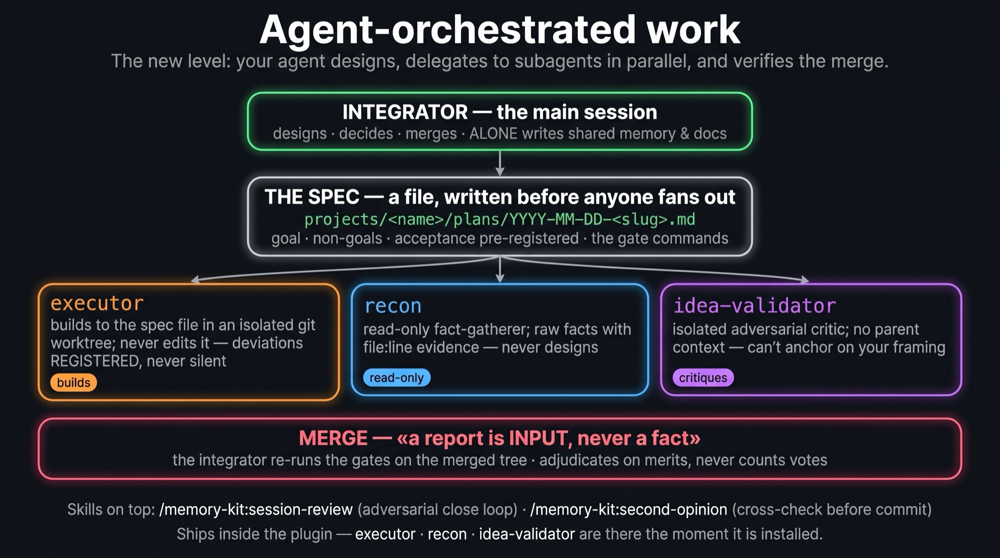
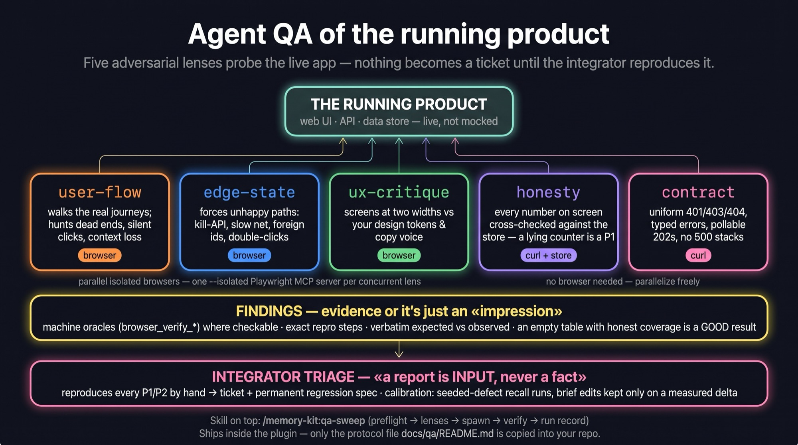

# memory-kit (plugin)

Persistent memory for coding agents, installed into a repository you already have.

```shell
/plugin marketplace add awrshift/agent-memory-kit
/plugin install memory-kit@memory-kit
/memory-kit:setup
```

Upgrading later — both steps, and the full `plugin@marketplace` id on the second one (the bare
name returns `Plugin "memory-kit" not found`):

```shell
claude plugin marketplace update memory-kit
claude plugin update memory-kit@memory-kit
```

## What it does at runtime

- **SessionStart** — injects the working agreement (`context/identity.md`), the discipline nudges
  that fire, session stats, **the hot cache itself**, the newest handoff and the knowledge index.
  Profile depends on `source`: `compact` gets back exactly what compaction dropped; `resume` gets
  only the nudges and stats.
- **PreCompact** — blocks compaction until `MEMORY.md` is fresh and inside its three caps
  (180 lines / 32 KB / 3000 chars per line).
- **PreToolUse(Edit|Write)** — asks before an existing test file is edited; never blocks the
  red→green loop; `CMK_ALLOW_TEST_EDITS=1` opts out for a session.
- **SessionEnd** — timestamp logging.

In a repository that never ran `/memory-kit:setup`, the hooks inject one pointer line and write
nothing.

## Skills

| Skill | For |
|---|---|
| `close-session` | the end-of-session ritual: capture → audit for 3+-date repetition → promote on a yes → handoff |
| `memory-audit` | cap-trip surgery on the hot cache, by an approved move plan |
| `system-audit` | the periodic seven-lens sweep of the whole system, every finding evidence-backed — including the transcript profiler that answers "did this layer ever fire" |
| `setup` · `tour` | adopt the kit here · walk through it on your own files |
| `session-review` · `second-opinion` | adversarial review of a session · of one high-stakes decision |
| `qa-sweep` | multi-lens agent QA of a running product (needs `projects/<name>/qa/README.md`, template in `reference/`) |

Agents: `executor` (builds to a spec file in a worktree) · `recon` (read-only facts) ·
`idea-validator` (isolated critic) · `qa` (one adversarial lens on the running app).




## Beyond Claude Code

The memory state is plain markdown, so any agent can follow it — with less enforcement.
Verified on Codex CLI (0.151.0): the same manifests install directly —

```shell
codex plugin marketplace add awrshift/agent-memory-kit
codex plugin add memory-kit@memory-kit
```

— and all 8 skills appear as `memory-kit:<name>`. On Cursor,
`cursor-agent plugin marketplace add <git-url>` indexes the same manifests, `--plugin-dir`
loads all 8 skills, and the CLI executes the SessionStart hook — injection works there.
Hosts that don't run the hooks lose the automatic injection and the PreCompact block;
`/memory-kit:setup` offers the replacement — an `AGENTS.md` protocol block
(`templates/workspace/AGENTS-MEMORY-PROTOCOL.md`) that hands them the same discipline as an
always-loaded instruction. What each host honours, probe by probe:
[`docs/specs/`](../../docs/specs/README.md).

## State it owns in your repository

Shared memory: `.claude/memory/MEMORY.md` · `context/handoffs/` · `knowledge/` · `.claude/rules/`.
Per project: `projects/<name>/` — `README.md` (the map of where that project's documents live),
`BACKLOG.md`, `plans/` (specs executors build to), `research/`, `decisions-log.md`,
`review-findings.md`, `qa/`, `materials/`. Everything past the first two appears on first use.

## Environment knobs

`CMK_INJECT_BUDGET` (48000) · `CMK_MEMORY_LINE_CAP` (180) · `CMK_MEMORY_BYTE_CAP` (32768) ·
`CMK_MEMORY_MAXLINE_CAP` (3000) · `CMK_ALLOW_TEST_EDITS`.

Architecture and rationale: [`../../docs/ARCHITECTURE.md`](../../docs/ARCHITECTURE.md).
